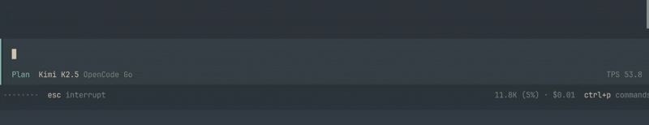

# opencode-tps

A plugin for [OpenCode](https://opencode.ai) that displays a live **Tokens Per Second (TPS)** meter in the terminal UI.



## What it does

This plugin adds a real-time TPS (tokens per second) counter to your OpenCode interface, showing how fast the AI model is generating tokens during streaming responses.

The meter appears in the bottom-right corner of the TUI and updates dynamically as the model streams output.

## Installation

### Via OpenCode CLI

```bash
opencode plugin @williamcr01/opencode-tps
```

### Via npm

1. Add the plugin to your `opencode.json`:

```json
{
  "$schema": "https://opencode.ai/config.json",
  "plugin": ["@williamcr01/opencode-tps"]
}
```

then

```bash
cd ~/.opencode
npm install @williamcr01/opencode-tps
```

## Requirements

- OpenCode >= 1.3.14
- OpenCode TUI (Web UI does not support this plugin)

## How it works

The plugin hooks into OpenCode's message streaming events to calculate real-time token generation speed:

- Tracks token deltas as they arrive from the AI model
- Calculates TPS based on a 5-second rolling window
- Displays "-" when no tokens are being generated
- Automatically clears when streaming completes or errors occur

## License

MIT
